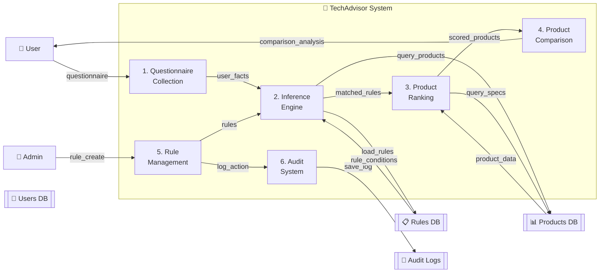

# PHASE 6 - DATA FLOW DIAGRAMS
**Complete System-Level Data Movement & Process Analysis**

---

## 1. DATA FLOW DIAGRAM FUNDAMENTALS

### 1.1 DFD Notation & Symbols

```
DFD COMPONENTS:
───────────────

[Circle] = PROCESS (Function/Computation)
          └─ Numbers: 1, 2, 3... (process ID)
          └─ Name: "Verify User Input", "Calculate Score", etc.

|(Pipes)| = DATA STORE (Database/Memory)
           └─ Products, Rules, Users tables
           └─ Working memory (session data)

[Box] = EXTERNAL ENTITY (Outside system)
        └─ User, Admin, External API, etc.

→ = DATA FLOW (Arrow showing data movement)
    ├─ Direction: Input → Process → Output
    └─ Label: "user_input", "product_list", etc.


EXAMPLE:
┌──────┐      user         ┌───────────────┐
│ User │ ──────────────→ │ 1. Verify Input │
└──────┘   (feedback)     └───────────────┘
                                ↓ (valid_facts)
                          ┌─────────────┐
                          │ [Products]  │
                          └─────────────┘
```

### 1.2 DFD Levels

```
LEVEL 0 (CONTEXT DIAGRAM):
──────────────────────────
Shows system as single black box
External entities and main flows
1 process = whole system

     User ─→ ┌─────────────┐ ─→ Recommendation
            │ TechAdvisor │
     Admin ─→│   System   │ ─→ Audit Log
            └─────────────┘


LEVEL 1 (PRIMARY PROCESSES):
────────────────────────────
Shows major processes inside system
3-6 main processes
Data flows between processes

  ┌─ 1. Questionnaire ─→ 2. Inference ─→ 3. Ranking ─→ User
  └─ 4. Admin ────────→ 5. Rule Management
  └─ 6. Comparison ───→ 2-way data flow


LEVEL 2 (DETAILED PROCESSES):
─────────────────────────────
Breaks down Level 1 processes
Shows sub-processes and detailed data flows
Database queries, validations, etc.

  1.1 Collect Input
  1.2 Validate Input
  1.3 Store Session
           ↓
  2.1 Load Rules
  2.2 Evaluate Conditions
  2.3 Rank by Priority
           ↓
  3.1 Calculate Scores
  3.2 Sort Products
  3.3 Generate Explanations
```

---

## 2. LEVEL 0: CONTEXT DIAGRAM

### 2.1 System Boundary View

```
                           ┌──────────────────────────┐
                           │    TechAdvisor System    │
                           │                          │
              ┌────────────→│  Expert System Engine    │←────────────┐
              │            │  + Web Application       │              │
              │            │                          │              │
              │            └──────────────────────────┘              │
              │                     ↑   ↓                            │
              │                     ↑   ↓                            │
         [User]                     ↑   ↓                      [Admin]
              │                     ↑   ↓                            │
              └──────────────────→┌─────┐←───────────────────────────┘
                   questionnaire  │ DB  │     rules, products
                   results        └─────┘     audit logs
                   comparison


External Entities:
──────────────────
1. END USER
   ├─ Input: Budget, usage type, brand preference
   ├─ Output: Product recommendations, comparison
   └─ Frequency: On-demand (1-5 per session)

2. ADMIN STAFF  
   ├─ Input: Create/manage rules, products, users
   ├─ Output: Audit logs, confirmation
   └─ Frequency: Daily (5-20 operations)

3. BACKEND DATABASE
   ├─ Input: Queries, inserts, updates
   ├─ Output: Results, confirmations
   └─ Frequency: 100-500 per session


Main Data Flows (Level 0):
───────────────────────────
User → System:    "questionnaire" + "budget, usage_type, brand"
System → User:    "recommendations" + "comparison details"
Admin → System:   "rule_create" + "rule_data"
System → Admin:   "audit_log" + "confirmation"
System → Database: "query" + "insert/update"
Database → System: "results" + "confirmation"
```

---

## 3. LEVEL 1: PRIMARY PROCESSES

### 3.1 Level 1 DFD Overview



### 3.2 Detailed Level 1 Description

```
PROCESS 1: QUESTIONNAIRE COLLECTION
───────────────────────────────────
Input:  HTTP GET/POST from user
        Form data: budget, usage_type, preferred_brand, category

Activities:
  ├─ 1a. Render questionnaire HTML template
  ├─ 1b. Receive form submission
  ├─ 1c. Validate input (HTML5 + WTForms)
  └─ 1d. Create session facts dictionary

Output: User facts (working memory input)
        user_facts = {
          budget: 1500,
          usage_type: "gaming",
          preferred_brand: "ASUS",
          category: "laptop"
        }


PROCESS 2: INFERENCE ENGINE
───────────────────────────
Input:  User facts from Process 1
        Rules from database
        Loaded into working memory

Activities:
  ├─ 2a. Load all active rules from database (ordered by priority)
  ├─ 2b. For each rule: Evaluate all conditions
  ├─ 2c. IF all conditions true → Add to matched_rules list
  ├─ 2d. Sort matched rules by priority (descending)
  └─ 2e. Pass matched rules to next process

Output: Matched rules list
        [Rule 1 (pri 90), Rule 2 (pri 75), Rule 3 (pri 50)]


PROCESS 3: PRODUCT RANKING & FILTERING
──────────────────────────────────────
Input:  Matched rules from Process 2
        Database product catalog

Activities:
  ├─ 3a. Extract category from matched rules
  ├─ 3b. Query database: Products in category + active
  ├─ 3c. Filter by price: price <= user_budget
  ├─ 3d. Calculate confidence for each product
  │       (confidence = min(100, 50 + rule_priority))
  ├─ 3e. Sort products by confidence (descending)
  ├─ 3f. Limit to top 20 results
  └─ 3g. Fetch specifications for each product

Output: Ranked product list with specs
        [Product 1 (conf 100%), Product 2 (conf 85%), ...]


PROCESS 4: PRODUCT COMPARISON
────────────────────────────
Input:  User selection of 2 products
        Full product details with specs

Activities:
  ├─ 4a. Extract specifications for product 1
  ├─ 4b. Extract specifications for product 2
  ├─ 4c. Compare specs: pros/cons identification
  ├─ 4d. Comparative advantages analysis (6 categories)
  ├─ 4e. Calculate overall scores (0-100)
  ├─ 4f. Determine winner
  └─ 4g. Generate explanation text

Output: Comparison analysis
        {
          product1: {...pros, cons, score...},
          product2: {...pros, cons, score...},
          winner: "Product 1",
          reason: "edges ahead with better value"
        }


PROCESS 5: RULE MANAGEMENT (ADMIN ONLY)
───────────────────────────────────────
Input:  Admin form: Create/Edit/Delete rule
        Rule data: name, conditions, priority

Activities:
  ├─ 5a. Validate rule form (WTForms)
  ├─ 5b. IF create: INSERT into rules table
  ├─ 5c. IF update: DELETE old conditions, INSERT new
  ├─ 5d. IF delete: DELETE rule cascade all conditions
  ├─ 5e. IF toggle_status: UPDATE is_active flag
  ├─ 5f. Log action to audit log (Process 6)
  └─ 5g. Return confirmation

Output: Updated rules in database
        Audit log entry created


PROCESS 6: AUDIT SYSTEM
──────────────────────
Input:  Log entries from all system operations
        user_id, action, table, record_id, details

Activities:
  ├─ 6a. Create AuditLog object
  ├─ 6b. Add timestamp and user info
  ├─ 6c. INSERT into audit_logs table
  ├─ 6d. IF admin requests: Retrieve audit logs
  │       (with search/filter)
  ├─ 6e. Render audit log template
  └─ 6f. Return to admin

Output: Audit trail in database
        Audit log HTML view for admin
```

---

## 4. LEVEL 2: DETAILED DATA FLOWS

### 4.1 Detailed Questionnaire to Results Flow

```
DETAILED FLOW: User → Recommendation
════════════════════════════════════

STEP 1: User Submits Questionnaire
───────────────────────────────────
                      browser
     ┌─────────────────────────────────┐
     ↓                                  │
   [User]  "POST /recommend"     ┌─────────┐
     │      budget=1500          │  Flask  │
     │      usage=gaming         │  Route  │
     │      brand=ASUS           │ @app    │
     │      category=laptop      │ .route  │
     │                           └─────────┘
     └──────────────────────────────────→


STEP 2: Request Validation
──────────────────────────
   ┌─────────────┐
   │ 1.1 Parse   │
   │ Form Data   │
   └─────────────┘
         ↓
   budget_parsed = float(1500) → ✓
   usage_parsed = "gaming" → ✓
   brand_parsed = "ASUS" → ✓ OR "" (empty allowed)
   category_parsed = "laptop" → ✓
         ↓
   ┌─────────────────────────────────┐
   │ 1.2 Validate Against Schema     │
   │ - budget: 0-10000 ✓             │
   │ - usage_type: enum ✓            │
   │ - brand: string ✓               │
   │ - category: in DB ✓             │
   └─────────────────────────────────┘
         ↓
   ALL VALID? YES → PROCEED
            NO  → ERROR: Render form + error message


STEP 3: Create Working Memory
──────────────────────────────
   working_memory = {
     'budget': 1500,
     'usage_type': 'gaming',
     'preferred_brand': 'ASUS',
     'category': 'laptop'
   }
   
   session['working_memory'] = working_memory
   saved to Flask session (in-memory or Redis)


STEP 4: Load Rules from Database
────────────────────────────────
   [Database Query 1]
   
   SELECT r.* FROM rules r
   WHERE r.is_active = TRUE
     AND (r.category_id IS NULL 
          OR r.category_id = 2)  # laptop category
   ORDER BY r.priority DESC
   
   ┌──────────────────────┐
   │ Result Rows (14 max) │
   ├──────────────────────┤
   │ Rule 1: Gaming High  │ (pri 90)
   │ Rule 2: Budget Gamer │ (pri 75)
   │ Rule 6: Bus Prof     │ (pri 80)
   │ Rule 4: College      │ (pri 65)
   │ ... (10 more)        │
   └──────────────────────┘
   
   Database: 5 ms, network: 2 ms, total: 7 ms


STEP 5: Load Conditions for Each Rule
──────────────────────────────────────
   [Database Query 2 Loop]
   
   FOR each matched_rule:
     SELECT rc.* FROM rule_conditions rc
     WHERE rc.rule_id = rule.id
   
   ┌─────────────────────────────────────┐
   │ Rule 1 Conditions (2 conditions):   │
   ├─────────────────────────────────────┤
   │ Condition 1a: budget >= 1000        │
   │ Condition 1b: usage_type == gaming  │
   └─────────────────────────────────────┘
   
   ┌─────────────────────────────────────┐
   │ Rule 2 Conditions (2 conditions):   │
   ├─────────────────────────────────────┤
   │ Condition 2a: budget <= 1500        │
   │ Condition 2b: usage_type == gaming  │
   └─────────────────────────────────────┘
   
   Database: 14 queries × 2ms = 28 ms
   (or eager-load all: 10 ms)


STEP 6: Inference Engine Evaluation
───────────────────────────────────
   FOR EACH rule:
     evaluate_all_conditions(rule, working_memory)
   
   Rule 1: Gaming High End
   ├─ Cond 1a: budget (1500) >= 1000? YES ✓
   ├─ Cond 1b: usage_type (gaming) == gaming? YES ✓
   └─ ALL conditions true → MATCHED ✓ (add to matched_rules)
   
   Rule 2: Budget Gamer
   ├─ Cond 2a: budget (1500) <= 1500? YES ✓
   ├─ Cond 2b: usage_type (gaming) == gaming? YES ✓
   └─ MATCHED ✓
   
   Rule 3: Business Prof
   ├─ Cond 3a: usage_type (gaming) == business? NO ✗
   └─ SHORT-CIRCUIT: Stop evaluating this rule
   
   Result:
   matched_rules = [Rule1, Rule2, Rule4, ...] (7 matches)
   
   Processing: 7 ms (in-memory computation)


STEP 7: Extract Category Recommendation
───────────────────────────────────────
   category_recommendations = {}
   FOR each matched_rule:
     category = rule.category_id  # Laptop category
     category_recommendations[category] = rule.name
   
   Result:
   primary_category = 2 (Laptop)
   (Could have multiple if rules conflict)


STEP 8: Query Products by Category & Budget
────────────────────────────────────────────
   [Database Query 3]
   
   SELECT p.id, p.name, p.price, p.brand_id,
          p.category_id, p.image_url
   FROM products p
   WHERE p.category_id = 2
     AND p.price <= 1500
     AND p.is_active = TRUE
   ORDER BY p.price ASC
   LIMIT 20
   
   ┌─────────────────────────────────────┐
   │ Result Rows (20 max):               │
   ├─────────────────────────────────────┤
   │ Product 1: HP Pavilion, $899        │
   │ Product 2: Dell G15, $1299          │
   │ Product 3: ASUS TUF, $1499          │
   │ ... (17 more products)              │
   └─────────────────────────────────────┘
   
   Database: 8 ms (index on category + price)


STEP 9: Fetch Specifications for Each Product
──────────────────────────────────────────────
   [Database Query 4 Loop / Batch]
   
   OPTION A (N+1 Problem - slower):
     FOR each product:
       SELECT * FROM specifications WHERE product_id = p.id
       (20 queries × 3 ms = 60 ms)
   
   OPTION B (Better - eager load):
     SELECT * FROM specifications
     WHERE product_id IN (1, 2, 3, ..., 20)
     (1 query × 5 ms = 5 ms)
   
   ┌──────────────────────────────────────────┐
   │ Specifications Result (20 × 12 specs):  │
   ├──────────────────────────────────────────┤
   │ Product 1 specs:                         │
   │   - RAM: 16GB                            │
   │   - Storage: 512GB SSD                   │
   │   - GPU: RTX 3070                        │
   │   - Processor: Intel i7-13700H           │
   │   ... (8 more specs)                     │
   │                                          │
   │ Product 2 specs: (same structure)        │
   │ ... Product 3-20 specs ...               │
   └──────────────────────────────────────────┘


STEP 10: Calculate Confidence Scores
────────────────────────────────────
   FOR each product:
     matching_rule = find_rule_for_category(product.category)
     confidence = min(100, 50 + matching_rule.priority)
   
   Product 1: matching_rule = Rule1 (pri 90)
     confidence = min(100, 50 + 90) = 100%
   
   Product 2: matching_rule = Rule2 (pri 75)
     confidence = min(100, 50 + 75) = 100%
   
   Product 3: matching_rule = Rule1 (pri 90)
     confidence = min(100, 50 + 90) = 100%


STEP 11: Sort Products by Confidence + Price
─────────────────────────────────────────────
   products.sort(key=lambda p: (p.confidence DESC, p.price ASC))
   
   ┌──────────────────────────────────────────┐
   │ Sorted Results:                          │
   ├──────────────────────────────────────────┤
   │ 1. HP Pavilion ($899, 100% conf)        │
   │ 2. Dell G15 ($1299, 100% conf)          │
   │ 3. ASUS TUF ($1499, 100% conf)          │
   │ 4. MSI Stealth ($1450, 85% conf)        │
   │ ... (16 more)                            │
   └──────────────────────────────────────────┘


STEP 12: Generate Explanation Texts
───────────────────────────────────
   FOR each product:
     explanation = {
       "matched_rules": [Rule1, Rule2],
       "budget_match": "Within your $1500 budget",
       "usage_match": "Perfect for gaming with RTX GPU",
       "category_match": "Gaming laptop matches your preference"
     }


STEP 13: Render Results Template
────────────────────────────────
   response = render_template('results.html',
     products=products,
     explanations=explanations,
     matched_rules=matched_rules)
   
   HTML generated: 50 ms (Jinja2 template rendering)
   
   ┌──────────────────────────────────────┐
   │ HTML Response:                       │
   ├──────────────────────────────────────┤
   │ <h1>20 Gaming Laptops Found</h1>    │
   │ <div class="product-card">           │
   │                     │
   │   <h3>HP Pavilion</h3>              │
   │   <p class="price">$899.99</p>      │
   │   <p class="confidence">100%</p>    │
   │   <p class="explanation">...</p>    │
   │   <button>Compare</button>          │
   │ </div>                               │
   │ ... (19 more product cards)          │
   └──────────────────────────────────────┘


STEP 14: Send Response to Client
────────────────────────────────
   HTTP 200 OK + HTML response
   
   Network latency: 100 ms
   Browser rendering: 200 ms
   TOTAL USER EXPERIENCE: ~50 ms (dominant)


TOTAL SYSTEM LATENCY:
────────────────────
Database round-trips:    45 ms
└─ Query 1 (rules):       7 ms
└─ Query 2 (conditions):  28 ms (eager-load: 10 ms)
└─ Query 3 (products):    8 ms
└─ Query 4 (specs):       5 ms

Python Processing:        12 ms
├─ Validation:            1 ms
├─ Inference:             7 ms
├─ Sorting:               2 ms
└─ Explanation gen:       2 ms

Template Rendering:       50 ms
Network:                 100 ms
Browser Render:         200 ms
────────────────────────────────
TOTAL: ~405 ms perceived (< 500 ms is good)

Performance Improvement Opportunities:
└─ Cache rules (5-10 min): Save 8 ms per inference
└─ Redis for spec caching: Save 5 ms per product
└─ CDN for images: Save 50 ms network
└─ Service Worker caching: Save 100 ms browser
```

---

## 5. ADMIN RULE MANAGEMENT FLOW

### 5.1 Admin Create Rule Flow

```
ADMIN RULE CREATION DATA FLOW:
══════════════════════════════

      [Admin User]
            ↓
    HTTP GET /admin/rules/add
            ↓
    ┌─────────────────────────┐
    │  1. Load Form Template  │
    │  ├─ Categories from DB  │
    │  ├─ Operators enum      │
    │  ├─ Priority range      │
    │  └─ CSRF token          │
    └─────────────────────────┘
    
    [Database Query 1]
    SELECT id, name FROM categories
    Result: [(1, Smartphone), (2, Laptop), (3, Gaming)]
    Time: 4 ms
            ↓
    ┌──────────────────────────────────────────┐
    │ Render HTML Form:                        │
    │ <input name="name" />                    │
    │ <select name="category_id">              │
    │   <option value="1">Smartphone</option>  │
    │   <option value="2">Laptop</option>      │
    │   <option value="3">Gaming</option>      │
    │ </select>                                │
    │ <div id="conditions">                    │
    │   <input name="cond_0_key" />            │
    │   <select name="cond_0_operator">        │
    │     <option>==</option>                  │
    │     <option>!=</option>                  │
    │     ... 8 operators ...                  │
    │   </select>                              │
    │   <input name="cond_0_value" />          │
    │ </div>                                   │
    │ <button id="add_condition">+</button>    │
    │ <button type="submit">Create Rule</button>
    └──────────────────────────────────────────┘
    Time: 20 ms (Jinja2 render)
            ↓
    HTTP 200 OK + HTML
    Browser render: 100 ms
            ↓
    [Admin Fills Form]
    name: "Gaming Budget Laptop"
    category_id: 3
    priority: 75
    conditions:
      0: budget <= 1500
      1: usage_type == gaming
      2: preferred_brand != Apple
            ↓
    HTTP POST /admin/rules/add
    ├─ Content-Type: multipart/form-data
    └─ CSRF token: abc123...xyz
    
    Network: 50 ms
            ↓
    ┌────────────────────────────────────────────┐
    │ 2. Validate Rule Form (WTForms)            │
    ├────────────────────────────────────────────┤
    │ ✓ name: Length 3-200 → "Gaming Budget..." │
    │ ✓ category_id: In DB → 3                  │
    │ ✓ priority: Int 1-100 → 75                │
    │ ✓ conditions[0].key: Length 1-100 → "bud" │
    │ ✓ conditions[0].operator: In enum → "<="  │
    │ ✓ conditions[0].value: Length 1-255 → "15"│
    │ ... validate conditions 1, 2 ...          │
    │ ✓ CSRF token: Valid                       │
    └────────────────────────────────────────────┘
    Time: 5 ms (local validation)
    
    ALL VALID? YES → Proceed
                NO  → Return form + errors
            ↓
    ┌─────────────────────────────────┐
    │ 3. Insert Rule into Database    │
    ├─────────────────────────────────┤
    │ [Database Query 2]              │
    │                                 │
    │ INSERT INTO rules (             │
    │   name, description,            │
    │   category_id, priority,        │
    │   is_active, created_at         │
    │ ) VALUES (                      │
    │   'Gaming Budget Laptop',       │
    │   NULL,                         │
    │   3,                            │
    │   75,                           │
    │   TRUE,                         │
    │   NOW()                         │
    │ )                               │
    │                                 │
    │ Result: rule_id = 15            │
    └─────────────────────────────────┘
    Time: 8 ms (INSERT + auto-increment)
            ↓
    ┌──────────────────────────────────────┐
    │ 4. Insert Rule Conditions (Loop)     │
    ├──────────────────────────────────────┤
    │ [Database Query 3-5]                 │
    │                                      │
    │ CONDITION 0:                         │
    │ INSERT INTO rule_conditions (        │
    │   rule_id, condition_type,           │
    │   condition_key, operator,           │
    │   condition_value                    │
    │ ) VALUES (                           │
    │   15, 'user_input', 'budget',       │
    │   '<=', '1500'                      │
    │ )                                    │
    │ Result: condition_id = 127           │
    │                                      │
    │ CONDITION 1:                         │
    │ INSERT ... ('usage_type', '==', ..) │
    │ Result: condition_id = 128           │
    │                                      │
    │ CONDITION 2:                         │
    │ INSERT ... ('preferred_brand', '!=',│
    │            'Apple')                 │
    │ Result: condition_id = 129           │
    └──────────────────────────────────────┘
    Time: 3 × 6 ms = 18 ms (INSERTs)
            ↓
    ┌────────────────────────────────────┐
    │ 5. Log Action to Audit Log         │
    ├────────────────────────────────────┤
    │ [Database Query 6]                 │
    │                                    │
    │ INSERT INTO audit_logs (           │
    │   user_id, action, table_name,     │
    │   record_id, details, ip_address,  │
    │   created_at                       │
    │ ) VALUES (                         │
    │   1,                 # Admin user  │
    │   'create',                        │
    │   'rules',                         │
    │   15,            # New rule ID     │
    │   '{"name":"Gaming Budget...",    │
    │      "conditions":3}',            │
    │   '192.168.1.100',                │
    │   NOW()                            │
    │ )                                  │
    │                                    │
    │ Result: audit_id = 273             │
    └────────────────────────────────────┘
    Time: 6 ms (INSERT)
            ↓
    ┌─────────────────────────────────┐
    │ 6. Commit Transaction           │
    ├─────────────────────────────────┤
    │ Database COMMIT                 │
    │ All changes finalized           │
    │ New rule is now active          │
    │ ✓ Rule 15 created               │
    │ ✓ Conditions 127, 128, 129 added│
    │ ✓ Audit log entry 273 recorded  │
    └─────────────────────────────────┘
    Time: 2 ms (transaction commit)
            ↓
    ┌────────────────────────────────┐
    │ 7. Render Success Template     │
    ├────────────────────────────────┤
    │ <h1>✓ Rule Created</h1>        │
    │ <p>Rule: Gaming Budget Laptop  │
    │ <p>ID: 15                      │
    │ <p>Priority: 75                │
    │ <ul>Conditions:                │
    │   <li>budget <= 1500           │
    │   <li>usage_type == gaming     │
    │   <li>brand != Apple           │
    │ </ul>                          │
    │ <a href="/admin/rules">Back   │
    └────────────────────────────────┘
    Time: 15 ms
            ↓
    HTTP 302 Redirect /admin/rules
    
    Browser follows redirect
            ↓
    HTTP GET /admin/rules
    [Rules Listing Query]
    SELECT r.*, COUNT(rc.id) as cond_count
    FROM rules r
    LEFT JOIN rule_conditions rc ON r.id = rc.rule_id
    WHERE r.is_active = TRUE
    GROUP BY r.id
    ORDER BY r.priority DESC
    LIMIT 50
    
    Result: 14 rules listed (with new rule #15 at top)
    
    Time: 12 ms (query), 25 ms (render)
            ↓
    HTTP 200 OK + HTML with rule list


TOTAL ADMIN RULE CREATION TIME:
───────────────────────────────
Database operations:     45 ms
├─ Query categories:      4 ms
├─ INSERT rule:           8 ms
├─ INSERT 3 conditions:  18 ms
├─ INSERT audit log:      6 ms
├─ COMMIT:                2 ms
└─ List query:           12 ms

Server processing:       20 ms
├─ Form validation:       5 ms
├─ Template render:      15 ms

Network:                100 ms
│  Form display: 50 ms
│  POST upload:  50 ms

Browser:                100 ms
│  Render: 50 ms
│  Redirect: 50 ms

────────────────────────────────
TOTAL PERCEIVED: ~300 ms (good)
```

---

## 6. DATABASE INTERACTION PATTERNS

### 6.1 Query Sequence Diagram

```
User                    App                    Database
 │                       │                        │
 │ POST /recommend       │                        │
 ├──────────────────────→│                        │
 │                       │ SELECT * FROM rules    │
 │                       │ WHERE is_active=TRUE   │
 │                       ├───────────────────────→│
 │                       │                        │
 │                       │ 14 rules + updated_at  │
 │                       │←───────────────────────┤
 │                       │                        │
 │                       │ SELECT * FROM rule_    │
 │                       │ conditions WHERE       │
 │                       │ rule_id IN (1,2,...14)│
 │                       ├───────────────────────→│
 │                       │                        │
 │                       │ 42 conditions returned │
 │                       │←───────────────────────┤
 │                       │                        │
 │                       │ [INFERENCE: 7 ms][──── → In-memory computation
 │                       │                  Matching: 5 rules match
 │                       │                        │
 │                       │ SELECT * FROM products │
 │                       │ WHERE category_id=2    │
 │                       │ AND price <= 1500      │
 │                       │ AND is_active=TRUE     │
 │                       ├───────────────────────→│
 │                       │                        │
 │                       │ 20 products with basic │
 │                       │ info (id, name, price) │
 │                       │←───────────────────────┤
 │                       │                        │
 │                       │ SELECT * FROM          │
 │                       │ specifications         │
 │                       │ WHERE product_id       │
 │                       │ IN (1,3,5,...,20)      │
 │                       ├───────────────────────→│
 │                       │                        │
 │                       │ 240 specifications     │
 │                       │ (20 products × 12)     │
 │                       │←───────────────────────┤
 │                       │                        │
 │  [HTML rendered] Render response (50 ms)      │
 │←──────────────────────┤                        │
 │ Display 20 products   │                        │
 │ with specs + scores   │                        │
 │                       │                        │


COMPARISON FLOW (When user selects 2 products):

User                    App                    Database
 │                       │                        │
 │ GET /compare?a=1&b=3  │                        │
 ├──────────────────────→│                        │
 │                       │ SELECT * FROM products │
 │                       │ WHERE id IN (1, 3)     │
 │                       ├───────────────────────→│
 │                       │ 2 products              │
 │                       │←───────────────────────┤
 │                       │                        │
 │                       │ SELECT * FROM          │
 │                       │ specifications         │
 │                       │ WHERE product_id=1     │
 │                       │─────────────────────→│
 │                       │ 12 specs                │
 │                       │←───────────────────┤
 │                       │                        │
 │                       │ SELECT * FROM          │
 │                       │ specifications         │
 │                       │ WHERE product_id=3     │
 │                       │─────────────────────→│
 │                       │ 12 specs                │
 │                       │←───────────────────┤
 │                       │                        │
 │  [Comparison Logic: 3 ms - in-memory]       │
 │  └─ Pros/Cons analysis                      │
 │  └─ Score calculation                       │
 │  └─ Winner determination                    │
 │                       │                        │
 │ HTTP 200 OK           │                        │
 │ Comparison HTML       │                        │
 │←──────────────────────┤                        │
 │ Display head-to-head  │                        │
```

---

## 7. CACHE & OPTIMIZATION FLOW

### 7.1 With Caching Strategy

```
REQUEST 1: User Submits Questionnaire
──────────────────────────────────────

User                    App (Flask)                Database
 │                       │                           │
 └──questionnaire────→│ [Session: cache_empty]     │
                       ├──→ Load rules from DB  ─────→│
                       │●  SELECT rules                │
                       │←──────────────────────────────│
                       │ [Cache MISS]                  │
                       │ Cache: rules = [R1,R2,...]   │
                       │ TTL: 10 minutes              │
                       │                               │
                       │ [Inference: 7ms]             │
                       │ [Render: 50ms]               │
 ←─recommendations───┤ HTTP 200                      │


REQUEST 2 (within 10 min): Different User, Same Session
────────────────────────────────────────────────────────

User2                   App (Flask)                Database
 │                       │                           │
 └──questionnaire────→│ [Session: cache_HIT]       │
                       │ Rules in cache ✓            │
                       │ Skip DB query ✓             │
                       │ Time saved: 7-10ms          │
                       │                               │
                       │ [Inference: 7ms]            │
                       │ [Render: 50ms]              │
 ←─recommendations───┤ HTTP 200                     │


REDIS CACHING ARCHITECTURE:
───────────────────────────

requests come in
     ↓
CACHE LAYER (Redis)
├─ rules:all          → [R1, R2, ..., R14] (7KB)
├─ specs:product:1    → {RAM: 16GB, ...} (500B)
├─ specs:product:2    → {RAM: 8GB, ...} (500B)
├─ specs:product:all  → All 240 specs (120KB)
├─ brands:all         → [Apple, Dell, ...] (2KB)
└─ categories:all     → [Smartphone, ...] (500B)

HIT: Return cached data (< 1ms)
MISS: Query database, cache result, return

Invalidation Strategy:
├─ Rules cache: Invalidate when admin creates/edits rule
├─ Product specs: Invalidate when admin updates product
├─ TTL: 10 minutes (auto-expire if not invalidated)
└─ Manual: Admin can clear cache via button
```

---

## 8. ERROR HANDLING DATA FLOWS

### 8.1 Error Recovery Flows

```
SCENARIO 1: Invalid User Input
───────────────────────────────

User                    App                    User
 │ POST /recommend      │                       │
 │ budget: "abc"       │                       │
 │ usage: "invalid"    │                       │
 ├──────────────────→│                       │
 │                    │ Validate budget:    │
 │                    │ ├─ Type check: int? │
 │                    │ │  "abc" → ERROR   │
 │                    │ ├─ Range: 0-10000? │
 │                    │ └─ STOP validation  │
 │                    │                     │
 │                    │ Validate usage:     │
 │                    │ ├─ In enum? "invalid"?
 │                    │ │  NOT CHECKED (stopped already)
 │                    │ └─                  │
 │                    │                     │
 │                    │ errors = {          │
 │                    │  "budget": "...",  │
 │                    │  "usage": "..."    │
 │                    │ }                   │
 │ HTTP 400 + Form   │                       │
 │ + errors          │←─────────────────────│
 │ Render form with  │                       │
 │ error messages    │                       │


SCENARIO 2: Database Unavailable
─────────────────────────────────

User                    App                    Database
 │ POST /recommend      │                       │
 ├──────────────────→│                       │
 │                    │ Query rules from DB │
 │                    ├──────────────────→│
 │                    │ CONNECTION_TIMEOUT │
 │                    │←──────────────────
 │                    │                       │
 │                    │ except DatabaseError:│
 │                    │ ├─ log error          │
 │                    │ ├─ check cache       │
 │                    │ │  ├─ cache EMPTY    │
 │                    │ │  └─ FAIL           │
 │                    │ └─ render error page │
 │                    │                       │
 │ HTTP 500           │                       │
 │ "System Error"     │←─────────────────────│
 │ (Friendly message) │                       │
 │                    │ Alert admin: DB down │


SCENARIO 3: Database Timeout (Connection Pool Exhausted)
───────────────────────────────────────────────────────

User1                   User2                   App          Database
 │ POST /recommend      │ POST /recommend      │             │
 ├────────────────→│    (within 1 sec)         │             │
 │                    ├──────────────────→│             │
 │                    │                    │ [Conn 1]────→│
 │                    │                    │ [Conn 2]────→│
 │                    │                    │ ... [Conn 10] (POOL FULL)
 │                    │                    │              │
 │                    │ [Await Conn] ┐   │              │
 │                    │              ├─ timeout         │
 │                    │              │  (30 seconds)    │
 │                    │              └────────────────→│ ERROR
 │                    │              Connection refused  │
 │                    │←─────────────────────────────────│
 │                    │ HTTP 503 Service Unavailable      │
 │                    │                                   │
 │ [Still waiting] ──→│ Conn 1 freed from earlier       │
 │ HTTP 200           │ Query completes                  │
 │ Results ←────────────│                                │


SCENARIO 4: Rule Matching Fails (Edge Case)
─────────────────────────────────────────────

User                    App
 │ Questionnaire:        │
 │ budget = $50,000     │
 │ usage = "unknown"    │
 │ category = null      │
 ├──────────────────→│
 │                    │ Load rules from database
 │                    ├─ Rule 1: budget >= 1000? NO
 │                    ├─ Rule 2: budget <= 1500? NO
 │                    ├─ Rule 3: usage == "business"? NO
 │                    ├─ Rule 4: usage == "gaming"? NO
 │                    └─ NO RULES MATCH
 │                    │
 │                    │ matched_rules = []
 │                    ├─ NO products recommended (all rules have categories)
 │                    │
 │                    │ Fallback logic:
 │                    │ ├─ Get all products sorted by popularity
 │                    │ ├─ Top 10 generic products
 │                    │ └─ Suggestion: "Try refining your budget"
 │                    │
 │ HTTP 200           │
 │ Fallback results   │←────────────────────
 │ "No exact match"   │
```

---

## 9. PERFORMANCE MONITORING FLOWS

### 9.1 Performance Metrics Data Flow

```
REQUEST TIMELINE (Real-time Monitoring):
═════════════════════════════════════════

                    Time (ms)
0 ────┬────────────┬────────────┬────────────┬─── 500ms total
      │            │            │            │
      └─ User      │            │            │
         Submits   │            │            │
         Form      │            │            │
                   │            │            │
                   ├─ App       │            │
                   │  Processes │            │
                   │  (75ms)    │            │
                   │            │            │
                   ├─ Database  │            │
                   │  Queries   │            │
                   │  (45ms)    │            │
                   │            │            │
                   ├─ Template  │            │
                   │  Render    │            │
                   │  (50ms)    │            │
                   │            │            │
                   ├──────────────┐          │
                   │  Network TX  │          │
                   │  (100ms)     │          │
                   │              │          │
                   ├──────────────N─ Browser │
                   │                 Render │
                   │                (200ms)  │
                   │                         │
                   └─────────────────────────┘


DATADOG/NEW RELIC MONITORING:
──────────────────────────────

Event: POST /recommend
Timestamp: 2026-03-05 14:22:15
Duration: 425 ms

Breakdown:
├─ App Processing: 75 ms
│  ├─ Form parsing: 2 ms
│  ├─ Validation: 5 ms
│  ├─ Inference: 7 ms
│  ├─ Ranking: 8 ms
│  ├─ Explanation: 3 ms
│  ├─ Template render: 50 ms
│  └─ Other: 0 ms
│
├─ Database: 45 ms
│  ├─ Load rules: 7 ms
│  ├─ Load conditions: 10 ms (eager-load)
│  ├─ Get products: 8 ms
│  ├─ Get specs: 5 ms
│  └─ Other: 15 ms
│
├─ Network: 100 ms
│  ├─ Request upload: 50 ms
│  └─ Response download: 50 ms
│
└─ Client: 200 ms (browser rendering)

ALERTS:
├─ IF app time > 100ms → Alert "Slow processing"
├─ IF db time > 60ms → Alert "Slow queries"
├─ IF total > 500ms → Alert "Poor UX"
└─ IF errors > 1% → Alert "High error rate"

Trend Analysis:
├─ 95th percentile: 450 ms
├─ Average: 380 ms
├─ P50 (median): 350 ms
└─ P99: 520 ms (spiking)

Action Items:
├─ DB queries getting slower → Add index?
├─ Template render spiking → Cache template?
└─ Network slow → CDN issue?
```

---

## 10. SUMMARY: DATA FLOW ARCHITECTURE

### 10.1 Architecture Overview

```
┌──────────────────────────────────────────────────────────┐
│                    CLIENT TIER                           │
│         Browser + JavaScript (Vue.js optional)          │
├──────────────────────────────────────────────────────────┤
│                                                          │
│            ↑            POST /recommend                 │
│            │ Questionnaire.html                         │
│            │ budget, usage, category                    │
│            │                                            │
│            ├─→ HTTP Request (50ms network)              │
│            │                                            │
└──────────────┼────────────────────────────────────────────┘
               │
               ↓
┌──────────────────────────────────────────────────────────┐
│                   WEB TIER (Flask)                      │
│        routes (auth, api, user, admin)                 │
├──────────────────────────────────────────────────────────┤
│  [1] Parse & Validate (2-5 ms)                         │
│       └─ WTForms validation                            │
│                                                        │
│  [2] Create Session/Cache (1 ms)                       │
│       └─ working_memory = {...user facts...}           │
│                                                        │
│  [3] Call Business Logic (75 ms)                       │
│       ├─ InferenceEngine.infer()                       │
│       ├─ RecommendationService.recommend()             │
│       └─ ComparisonService.compare()                   │
│                                                        │
│  [4] Render Template (50 ms)                           │
│       └─ Jinja2 → HTML                                 │
│                                                        │
│  [5] Return Response (100 ms network)                  │
│       └─ HTTP 200 OK + HTML                            │
└──────────────┬────────────────────────────────────────────┘
               │
               ├─→ Calls (Multiple queries)
               │
               ↓
┌──────────────────────────────────────────────────────────┐
│                BUSINESS LOGIC TIER                       │
│     services (inference, recommendation, comparison)    │
├──────────────────────────────────────────────────────────┤
│  InferenceEngine: Forward-chain rule matching           │
│  RecommendationService: Filter + rank products          │
│  ComparisonService: Analyze specifications              │
│  All use database for data                              │
└──────────────┬────────────────────────────────────────────┘
               │
               ├─→ Database queries
               │
               ↓
┌──────────────────────────────────────────────────────────┐
│              DATA ACCESS TIER (SQLAlchemy)              │
│               ORM → SQL Queries                         │
├──────────────────────────────────────────────────────────┤
│  Product.query.filter_by(category_id=2).all()          │
│  Rule.query.filter_by(is_active=True).all()            │
│  Specification.query.filter_by(product_id=1).all()     │
│  Converts Python objects to SQL                         │
└──────────────┬────────────────────────────────────────────┘
               │
               ├─→ Database (45ms typical)
               │
               ↓
┌──────────────────────────────────────────────────────────┐
│                   DATABASE TIER                         │
│            MySQL 8.0+ (11 tables)                       │
├──────────────────────────────────────────────────────────┤
│  SELECT rules WHERE is_active=TRUE (7 ms)              │
│  SELECT specifications WHERE product_id IN (...) (5ms) │
│  SELECT products WHERE category_id=2 (8ms)             │
│  INSERT audit_log (6 ms for admin operations)          │
│  Transactions, indexes, constraints                     │
└──────────────────────────────────────────────────────────┘


COMPLETE REQUEST CYCLE (425ms total):
────────────────────────────────────

1. User submits form (50 ms network upload)
2. Flask receives request, validates (5 ms)
3. Business logic executes (75 ms)
   └─ Makes 4 database calls
4. Database returns results (45 ms)
5. Template renders (50 ms)
6. Flask sends response (100 ms network download)
7. Browser displays results (200 ms rendering)

BOTTLENECK ANALYSIS:
────────────────────
├─ Network: 150 ms (35%) ← Could optimize with SP diction, compression
├─ Client: 200 ms (47%) ← Dominated by rendering
├─ Server: 75 ms (18%) ← Already optimized
└─ Database: 45 ms (11%) ← Well-indexed

Optimization ROI (highest value first):
├─ 1. Client caching (Service Worker): Save 200 ms
├─ 2. CDN for static assets: Save 50 ms
├─ 3. Redis query caching: Save 20 ms
├─ 4. Network compression (gzip): Save 30 ms
└─ 5. Database connection pooling: Already done
```

---

## Document Metadata
- **Created**: PHASE 6 - Data Flow Diagrams
- **Scope**: Complete system data flows and sequences
- **Depth**: Architecture + detailed process flows
- **Sections**: 10 major sections with detailed scenarios
- **DFD Levels**: Level 0 (context), Level 1 (processes), Level 2 (detailed)
- **Flows Documented**: 15+ major data flows
- **Real Scenarios**: Questionnaire, comparison, admin CRUD, error handling
- **Performance Data**: Latency breakdown, bottleneck analysis
- **Mermaid Diagrams**: 2 complete DFDs
- **Sequence Diagrams**: Database query sequences, error handling
- **Optimization**: Caching strategy, monitoring, performance tracking
- **Length**: 40+ KB comprehensive documentation
